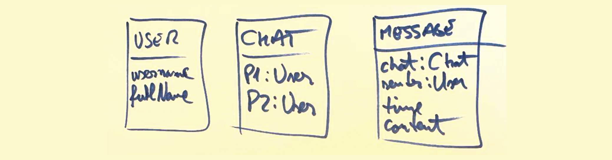

# Backends and the Parse Platform

## Backends

- What is a backend?
	- Defined in opposition to the front-end
	- The server side in a ***client-server architecture***


- What are the responsibilities of the backend?
	- authentication (proving that a user is who they say they are)
	- session management
	- business logic and DB access
	- scheduled jobs (e.g., `cron`)
	- authorization (what can a user do)


- Deploying and implementing a traditional backend
	- machine installation!
	- operating system
	- security & firewall
	- DBMS
	- web server
	- API 
	- logging and analytics
	- backup system


- **Low-code backends**
	- Common solutions for common backend problems
	- Alternatives
		- Firebase = proprietary & hosted by Google
		- Azure = Microsoft’s version 
		- **Parse Server** = open source 


## Parse Platform

Our preferred low-code backend
- Implementation language
	- Node.js based
- History
	Startup => facebook => open source
- Functionality
	- Authentication
	- File storage
	- APIs (REST & GraphQL)
	- Javascript wrapper library
	- Cloud functions
	- Authorization


### Using Parse from Back4App

- Where is the Parse server?
	- On your own hardware
	- In your own cloud server
	- In somebody else's cloud server => back4app.com 


Steps to start working with the Back4App Parse deployment 
1. Create an account on Back4App
2. Install the `parse` library from npm
3. Initialize the global Parse object (see step 4 in the [back4app guide](https://www.back4app.com/docs/react/quickstart))
 
Then you can write code like you see in the examples below.

## Saving a New Object to the Database

```javascript

import Parse from 'parse';

const Topic = Parse.Object.extend("Topic");
const topic = new Topic();

topic.set("name", "Backends");
topic.set("isDiscussed", false);

topic.save().then(
	(topicObject) => {
		console.log("saved with id: " + topicObject.id);
}, (error) => {
	console.log(error.message);
})
```

To understand in the code above:
- Creating a class for the object
- `save()` - sends the data to the server
- `save.then( (obj) => {...})` - save returns a *promise*


# JS Intermezzo: Async Programming and Promises

- What is [asynchronous programming](https://developer.mozilla.org/en-US/docs/Learn/JavaScript/Asynchronous/Introducing)?
	- Technique that enables your program to start a potentially long-running task and still be able to be responsive to other events while that task runs


- [What are Promises and how to Use Them?](https://developer.mozilla.org/en-US/docs/Learn/JavaScript/Asynchronous/Promises) 
	- Using the `then` syntax for promises
	- Using `await` with promises in `async` functions
	- How to chain two promises? 


Promises are often used when requesting something from a server, as in the following example:

```javascript 
function fetchMorty() {

	return fetch('https://rickandmortyapi.com/api/character/2')
		.then(response => response.json())
		.then(data => console.log(data))
		.catch(error => console.error(error));

}
```

Declaring the function to be async allows us to use the `await` keyword and makes the code easier to read:

```js
async function fetchMorty() {

	const response = await fetch('https://rickandmortyapi.com/api/character/2');
	const data = await response.json();
	console.log(data);
}
```

Surely, one needs to also handle exceptions: 

```js
async function fetchMorty() {
	try {
		const response = await fetch('https://rickandmortyapi.com/api/character/2');
		const data = await response.json();
		console.log(data);
	} catch (error) {
		console.error(error);
	}
}
```


## User Management with Parse

To read: [User Creation / Login](https://www.back4app.com/docs/react/working-with-users/sign-up-page-react)


# Querying the Database

Take the following database model: 



In it, `p1` and `p2`, and `sender` are of type `Pointer` pointing to the `User` class. And `chat` is a pointer to the `Chat` class. 

Let us assume that we have a component named `ListOfChats` that aims to list all the chats. Since the logged in user can be accessed with the `Parse.User.current()`, one could use the following implementation to get all the chats in which the current user is `p1`: 

```javascript

function ListOfChats() {

	// define the state var in which we keep the chat list
	const [chatList, setChatList] = useState(null);
	const currentUser = Parse.User.current();

	// load the chat info when component is rendered first time
	useEffect(() => {  
	    loadChatData();  
	}, []);


	// actual data loading from the DB 
	async function loadChatData() {  

	    let query = new Parse.Query("Chat");  
	    query.equalTo("p1", currentUser);  
	  
	    let listOfChats = await query.find();  
	  
		// changing the state will re-render the component once the 
		// data is ready
	    setChatList(chats);  
	};


	if (chatList === undefined) {
		return "Loading..."
	}


	return (
		<>
			{chatList.map(chat => {chat.id})}
		</>
	)
	}

```


Now because rendering the `id` of a chat is meaningless, and because our chat model has no other information besides the pointers to the participants `p1` and `p2` what we want to render is in fact, the name of the other participant to the chat. If we only show the chats were we are participant `p1`, then we could try to render the `fullName` of `p2`. One way to try to do this, is with the following code, that fails:  

```js
	return (
		<>
			{chatList.map(chat => {chat.get("p2").get("fullName")})}
		</>
	)
	
```

The reason for this failure is that our query object has only retrieved from the DB info in the Chat table. Thus, we do not have access to the `fullName` info in the `User` table. To access that, there are three alternative ways: 

### Alternative 1

One possible way to do that is to make another query to the Database for each chat. Since queries return promises, this results in quite a challenging dance of async/awaits. 

More precisely, for each chat object retrieved by `find` we are making a new query to the DB to get the `fullName` for the corresponding `p2` user: 

```js
	// actual data loading from the DB 
	async function loadChatData() {  

	    let query = new Parse.Query("Chat");  
	    query.equalTo("p1", currentUser);  
	  
	    let listOfChats = await query.find();  

		let chatUsernamePairPromises = listOfChats.map(async chat => {
		
			let userQuery = new Parse.Query("User");
			userQuery.equalTo("objectId", chat.get("p2").id);
			
			let user = await userQuery.first();

			// returning a new kind of object that mixes the 
			// and the username of the person we're chatting to
			return {id: chat.id, name: user.get("fullName")}
			
		})

		let chatUsernamePairs = await Promise.all(chatUsernamePairPromises);

		// changing the state will re-render the component once the 
		// data is ready
	    setChatList(loadChatData);  
	};


```

Notes
- The lambda function inside of the call to `map` ...
	- ... is an anonymous `async` function, because inside it we have to do call `await` for every query for the details of every User object linked in the 
	- ... uses the `first()` query function instead of the `find()` because we know for sure that we have a single  object that matches our query (there can only be one user with a given id). When we call `find()` we get an array of objects; when we call `find()` we get a single object.
	- ... returns a list of promises!!! (because every async function always returns a promise)
- Before we can set the state variable with `setChatList` we have to make sure that all the promises in our list of promises have finished. To do that we call the `await Promise.all(...)` function as in the example
- If you understand this, then you will never be afraid of `async/await` ever again. 


### Alternative 2

Parse has a more elegant solution to the problem above. Instead of us going to the database for every chat object with a new query, we can ask the API it to retrieve also details for Pointer objects. In our case, because we only care about `p2` we ask it to include objects pointed at by `p2` in the following way: 

```js
	async function loadChatData() {  

	    let query = new Parse.Query("Chat");  
	    query.equalTo("p1", currentUser);
	    query.include("p2"); // <--- the magic line
	  
	    let listOfChats = await query.find();  
	  
		// changing the state will re-render the component once the 
		// data is ready
	    setChatList(chats);  
	};
```

Now we can use the following line of code for getting the fullName

```js
chat.get("p2").get("fullName")
```

### Alternative 3
Another approach to the example above, is to move the getting of the information about the Chat into its own separate component. In that case, the `ListOfChats` component becomes simpler and leaves to the individual `Chat` element the responsibility for querying the DB for the user's `fullName`:  

```js

const ListOfChats = () => {  
  const currentUser = Parse.User.current();  
  const [chatList, setChatList] = useState();  
  
  useEffect(() => {  
        loadChats();  
    }, []);  
  
  async function loadChats() {  
        let query = new Parse.Query("Chat");  
        query.equalTo("p1", currentUser);  
        let listOfChats = await query.find();  
        setChatList(listOfChats);  
    };  
  
  if (chatList === undefined) {  
        return ("Loading...");  
    }  
  
  return (  
    <div>  
        <h4>Recent chats</h4>  
          {chatList.map(chat => <Chat chat={chat}/>)}  
    </div>  
  )  
}
```

And the responsibility of getting the username for a given chat, is delayed till the first rendering of the `Chat` component as shown below: 

```js

function Chat({chat}) {  
  
    const [username, setUsername] = useState();  
  
    async function loadUsername () {  
        let userQuery = new Parse.Query("User");  
        userQuery.equalTo("objectId", chat.get("p2").id);  
        let user = await userQuery.first();  
        setUsername(user.get("fullName"));  
    }  
  
    useEffect(() => {  
        loadUsername();  
    }, []);  
  
    if (username === undefined) {  
        return <small>loading</small>  
    }  
  
    return (  
        <div>  
            <a href={"/chats/"+chat.id}>{username}</a>  
        </div>  
    )  
}

```

and the ChatListPage would simply delegate to the `Chat` component as below:
In our example, this is still sub-optimal because we are sending more queries than necessary to the DB. However, in other situations this might be a solution. 


# Using Parse - Further References

*Read as needed* 

Two *alternative documentation sources*
- The Back4App [React Quickstart Guide](https://www.back4app.com/docs/react/quickstart) <-- nicer we think
- The Parse.js [Getting Started Guide](https://docs.parseplatform.org/js/guide/#getting-started)

- [CRUD operations](https://www.back4app.com/docs/react/data-objects/react-crud-tutorial)
	- CRUD = **Create, Read, Update, and Delete objects to/from the DB**
- [Basic Data types](https://www.back4app.com/docs/react/data-objects/react-data-types)
- [Relationships](https://www.back4app.com/docs/react/data-objects/relationships)
	- **Model a relationship between two objects** (e.g, User and Topic)
- [Basic Queries](https://www.back4app.com/docs/react/data-objects/react-query)
	- **Query for a list of objects**

- [Query Cookbook](https://www.back4app.com/docs/react/data-objects/react-query-cookbook)
	- Filters


## Individual Work
- Solve the [Sequencing Animations](https://developer.mozilla.org/en-US/docs/Learn/JavaScript/Asynchronous/Sequencing_animations) problem
- Mandatory reading:
	- [What are Promises and how to Use Them?](https://developer.mozilla.org/en-US/docs/Learn/JavaScript/Asynchronous/Promises) 


## Project Work
- Start saving and loading data to and from the database

