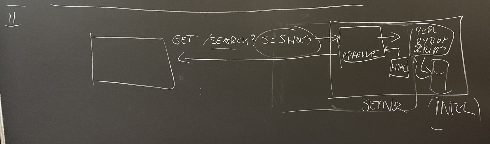
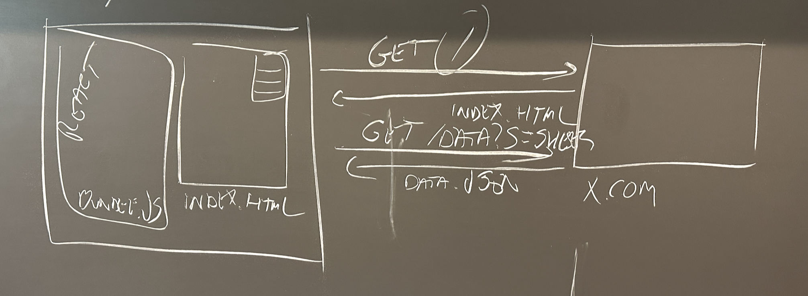

# Brief History of Web App Architectures

## Basic Concept

- Q: What's a server? Is it Hardware, or is it Software? 
- A: The term is used for both. Example HW server: *our server is an AMD machine with 64GB of RAM*. Example of SW server: *we are using the Apache web server that's listening on port 80*. 

## First generation of web applications were simple pages.

The server, usually Apache at that time, was simply sending a file back. 

## 2nd generation web application uses scripts on the server to generate pages on the fly

the example in the image below shows how different pages are generated when the client (browser) sends a request by using a parameterized `GET` request (e.g. `GET /search?term=shoes`)

## 3rd generation are Single Page Applications

The example in the image below shows that the server now sends both an `index.html` and a React-generated `bundle.js` that's imported from it to the client. The whole application logic is in the `bundle.js` file and is generated by a compilation process on the server. 

Notes:
- React is just an example, other frameworks are used for this architecture
