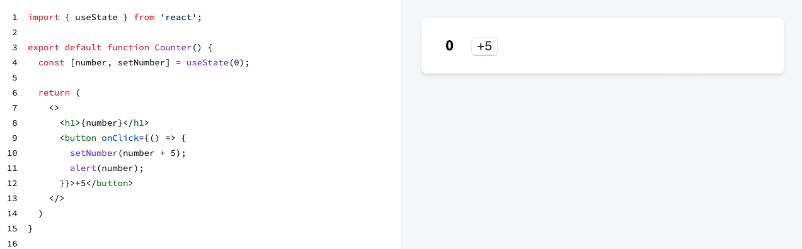
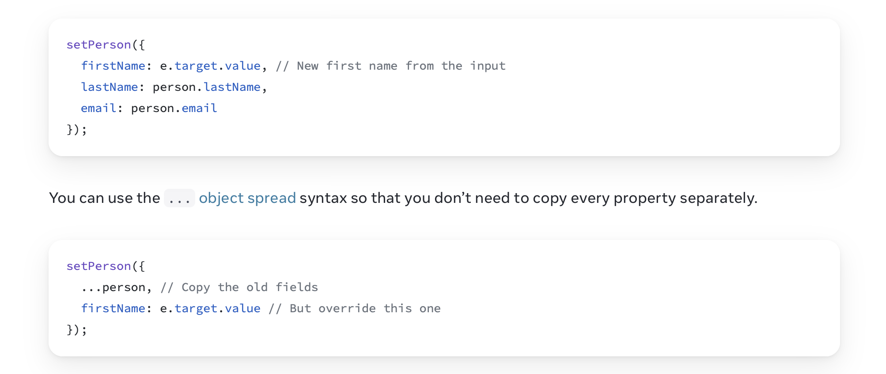
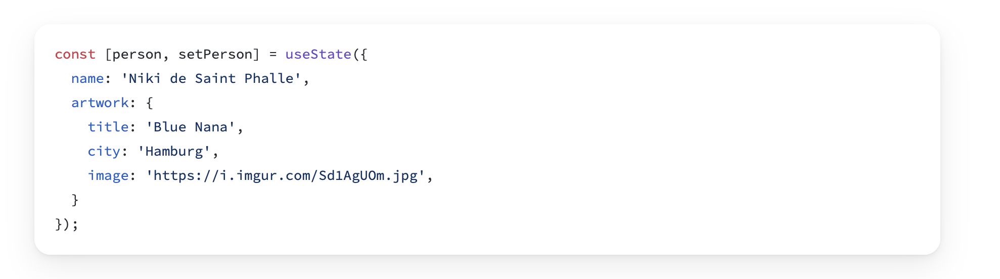
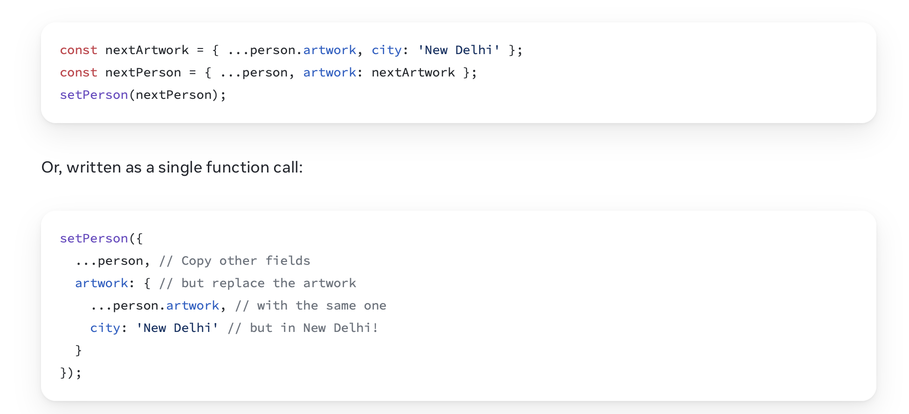
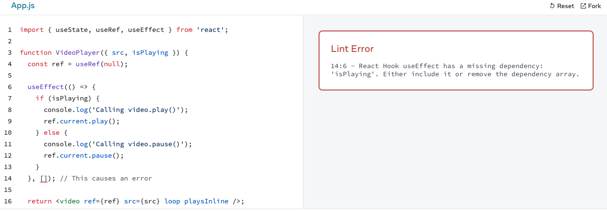
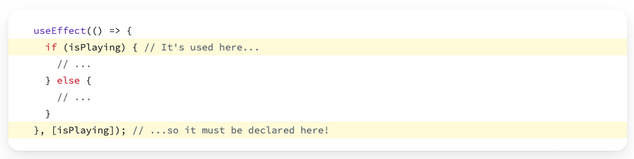

# Adding Interactivity (contd.)

## [Render and Commit](https://react.dev/learn/render-and-commit)
*Note: the restaurant metaphor is not very useful*

**What to understand**
- Change of state in a component triggers a component re-render
- Besides the re-rendered component, all it's children will also be re-rendered

- Rendering is logical 
	- react has a virtual DOM that it updates 
	- then updates the real DOM only in those parts where this is necessary

## [State as a Snapshot](https://react.dev/learn/state-as-a-snapshot)
*Note: the snapshot metaphor is not find very useful*

**What to understand**
- “Rendering” means that React is calling your component, which is a function. 
	- JSX returned from function a *snapshot of the UI in time*
	- Its props, event handlers, and local variables were all calculated using its state at the time of the render

- The state is not changed immediately after you call the setter, but later when React does all the state changes. 


Play with the [example](https://react.dev/learn/state-as-a-snapshot#state-over-time)!

## [Queueing A Series of State Updates](https://react.dev/learn/queueing-a-series-of-state-updates)

**What to understand**
- Updater Functions = powerful concept, seldom needed
- Setting state does not change the variable in the existing render, but it will be changed in the  new render

## [Updating Objects in State](https://react.dev/learn/updating-objects-in-state)

Modifying an object is called **mutating an object**.

- **What to understand**
- you don't mutate state objects in React because react does not *see* that
- modifying objects is *easiest* with the *spread syntax*: 
	
- updating nested objects is ... a little bit ugly
	


## [Updating Arrays in State](https://react.dev/learn/updating-arrays-in-state)

Use spread syntax to create a copy of an array, e.g. `[...artists]`.


**What to understand**
- Once you have a copy, you can simply add elements at the end, e.g. 

```
setArtists( 
	[ 
		...artists, // that contains all the old items  
		{ id: nextId++, name: name } // and one new item at the end  	
	]  
);
```

- Removing an element from an array: `filter` or `slice` (never use `splice` -- that one mutates the object)

```
setArtists([  
	{ id: nextId++, name: name },  
	...artists // Put old items at the end  
]);
```


- Replacing an element in the array can be done with `map` 
	- map = one of the most important functions in functional programming 
	- Google invented a whole new big data processing around it named MapReduce

```
  function handleClick() {
    const nextShapes = shapes.map(shape => {
      if (shape.type === 'square') {
        return shape;
      } else {
        return {
          ...shape,
          y: shape.y + 50,
        };
      }
    });
    setShapes(nextShapes);
  }
```
 ( [example](https://codesandbox.io/s/s4vvyz?file=%2FApp.js&utm_medium=sandpack))

- Inserting an element  can be done with two uses of `slice`: 

```
  function handleClick() {
    const insertAt = 1; // Could be any index
    const nextArtists = [
      
      // Items before the insertion point:
      ...artists.slice(0, insertAt),
      
      // New item:
      { id: nextId++, name: name },
      
      // Items after the insertion point:
      ...artists.slice(insertAt)
    ];
    setArtists(nextArtists);
    setName('');
  }

```

- Sorting, reversing - `reverse`, `sort` -- they mutate the array. But it's ok if you copy the array first, and then mutate it the way you like


# Managing State

## [Reacting to Input with State](https://react.dev/learn/reacting-to-input-with-state)
*Note: seems to me to me to be needlessly theoretical*

To Understand
- How declarative UI programming differs from imperative UI programming
- How to model multiple states of a component
	- have a state variable
	- represent it with useState
	- render different states in terms of that
	- do not use redundant state variables (the whole discussion in Remove non-essential variables)

[Example](https://codesandbox.io/s/wnphcd?file=%2FApp.js&utm_medium=sandpack) of multiple states for a component. 
- note the Promise in the example

```
return new Promise((resolve, reject) => {

	setTimeout(() => {
		let shouldError = answer.toLowerCase() !== 'lima'
		if (shouldError) {
			reject(new Error('Good guess but a wrong answer. Try again!'));
		} else {
			resolve();
		}
	}, 1500);

});
```

Nice [Example](https://codesandbox.io/s/dg3sry?file=%2FApp.js&utm_medium=sandpack) of how to show all the possible states of a component at once.


Live challenge: 
		- 2. Profile Editor is a good one; everybody should be able to do this


# [Synchronizing with Effects](https://react.dev/learn/synchronizing-with-effects#step-1-declare-an-effect)

Some components need to be synchronized with external systems (send a message to a server, save something in localStorage, etc.)

Effects let you run some code after rendering so that you can synchronize your component with some system outside of React

Two types of logic inside React components:
1. Rendering code => a transformation from props & state into JSX 
2. Event handlers => functions that do things -- change state, submit HTTP POST request, navigate to another screen, interact directly with the DOM (e.g. change page title)

When is this not sufficient?
Example
- when a ChatRoom component must connect to the server to download the corresponding info
- this is considered a side-effect (with respect to the main responsibility of the component which is to render something)

In general
- effects in React are directly caused by the rendering
- thus, they are called at the end of a commit, **after the screen updates**
- why is this a good time to sync components with external systems? 

How to define an effect?


#### 1. Declare it: `import { useEffect } from 'react';`

	- `useEffect` is a React Hook that lets you [synchronize a component with an external system.](https://react.dev/learn/synchronizing-with-effects) 
	- You always put hooks at the top of your component

```
function MyComponent() {  

	useEffect(() => {  
		console.log("every render!")
	});  
	return <div />;  
}
```

Every time the component renders, React updates the screen and then runs the code inside useEffect. 

Interesting example: [controlling a video player component](https://react.dev/learn/synchronizing-with-effects#step-1-declare-an-effect) with an effect
- you need to interact with the DOM
- get a reference to the relevant DOM element
- call the `start` and `stop` methods 

#### 2. Specify the Effect dependencies 

Observe in the example: 
- adding the empty dependencies array `[]` as a second argument to `useEffect` results in an error


- adding `isPlaying` as second argument fixes the problem



### 3. Add cleanup if needed 

- If your effect allocates a resource that can be deallocated, do that by returning a *cleanup function*
- Pay attention at the syntax it's **an arrow function that does the connection, and then returns another function that does the disconnect** 
- Important: **If you call an effect with no dependencies, it is only run once, on mount!**


- During development, React runs the useEffect twice on mount


# To think about
- why is reading from a server considered a side-effect in react? 