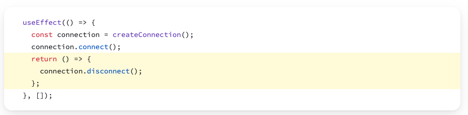

# [Effects](https://react.dev/learn/synchronizing-with-effects#step-1-declare-an-effect)

Two types of logic inside React components:
1. **Rendering code** => a transformation from props & state into JSX 
2. **Event handlers** => functions that do things -- change state, submit HTTP POST request, navigate to another screen, interact directly with the DOM (e.g. change page title)

There is a third type of logic: 

3. When *as a side effect of changing state* you must to do something else besides re-render


*Example*: 
- When a ChatRoom component must connect to the server to download the corresponding info
- When you want to change the title of the page based on some info that the component knows
- When you want to save something to database based on some changes in the UI


**Side Effects in React = actions that a functional component does besides rendering the component.**

The goal: synchronize your component with some system outside of React

# Three steps to define an effect
#### 1. Declare it: `import { useEffect } from 'react';`

- `useEffect` is a React Hook that lets you [synchronize a component with an external system.](https://react.dev/learn/synchronizing-with-effects) 

```javascript
function MyComponent() {  

	useEffect(() => {  
		console.log("every render!")
	});  
	return <div />;  
}
```

**Every time the component renders, React updates the screen and then runs the code inside useEffect.** 

Show coding example: 
- update the title page with the number of items, e.g. 

#### 2. Specify the Effect dependencies 


What happens if you forget to mention the dependency in the dependencies array but you still refer to it? 

**Important**: If you call an effect with an **empty dependencies list**, **it is only run once, on mount!**

Why would you want to run something only on mount? What kind of things would you want to do? 


Live Coding: Saving Data in Loca Storage
- [The JSON namespace in the browser](https://developer.mozilla.org/en-US/docs/Web/JavaScript/Reference/Global_Objects/JSON)
- [localStorage API](https://developer.mozilla.org/en-US/docs/Web/API/Window/localStorage) includes: `setItem` and `getItem` which both *work on strings*


### 3. Add cleanup if needed 

- If your effect allocates a resource that can be deallocated, do that by returning a *cleanup function*
- Pay attention at the syntax it's **an arrow function that does the connection, and then returns another function that does the disconnect** 




Another example of resource that needs to be released: a timer!

```javascript
useEffect(() => {
  setInterval(() => {console.log("hello")},1000)
}, [])
```

The correct way of handling it: 
```javascript
useEffect(() => {
  let interval = setInterval(() => {console.log("hello")}, 1000)

  return () => {
    clearInterval(interval) // clear the interval in the returning function
  }
}, [])
```


**Note:** During development, React runs the useEffect twice on mount

Why? if your code works in this situation, it means you're cleaning up nicely; and that's good!


# React Hooks 

Special React functions for "hooking into" the framework
- their name starts with `use`
- called at the top of the component
- can be called from another hook or directly from a component
- can't be called from within a conditional expression or nested functions


Most Popular
- `useState` -- to allow you to define state
- `useEffect` -- to allow you to handle side effects
- `useRef` -- an object that can be persisted across renderings but is not state


## [Using `useRef` for manipulating DOM elements](https://react.dev/learn/manipulating-the-dom-with-refs)

Sometimes you want to manipulate the DOM in ways that React does not help you to. E.g. 
- ***automatically focusing a given element*** when a component is first time rendered.  
- scrolling to a given node
- getting the dimensions of a given DOM node


The `useRef` hook returns an object with one property: `current`. 
It is persisted between renders. 


Example of **automatically focusing a given element on first render**: 
1. import `useRef`
2. declare a ref object (i.e. `inputRef`)
3. pass your object as the `ref` attribute to the desired DOM element

```javascript
import {useRef, useEffect} from 'react'

const InputRefExample = () => {

	  const inputRef = useRef(null);
  
  useEffect(() => {
    inputRef.current.focus()
  }, [])
  
  return(
    <div>
      <input ref={inputRef} />
      <button onClick = {() => inputRef.current.focus()}>Submit</button>
    </div>
  )
}
export default inputRefExample
```


Nice example: [controlling a video player component](https://react.dev/learn/synchronizing-with-effects#step-1-declare-an-effect)
- you need to interact with the video element in the DOM 
- get a reference to the relevant DOM element
- call the `start` and `stop` methods 


# Third Party Libraries
- How do you instal dependencies with `npm`?
- Do you have to do `nmp install` for every project?
- Why do we list dependencies in `packages.json`? 
- What is the meaning of the version numbers in `packages.json`? [How is semantic versioning used in npm?](https://docs.npmjs.com/about-semantic-versioning)
- Finding libraries on https://www.npmjs.com

Live Demo Example 
- Adding a progress-bar from [`mui`](- https://mui.com/material-ui/react-progress/)


# Routing

#### What is routing in web applications?

#### What are Single Page Applications (SPAs)? Why are they useful? 

#### Who does the routing in Single Page Applications? 

#### Why do you need a library for routing in React?
#### What are the essential elements that a router library should cover? 


# Project Work
- Find out what's the difference between `react-router` and `react-router-dom`
- Add the right dependency to your project
- Implement basic routing for at least two of the screens


