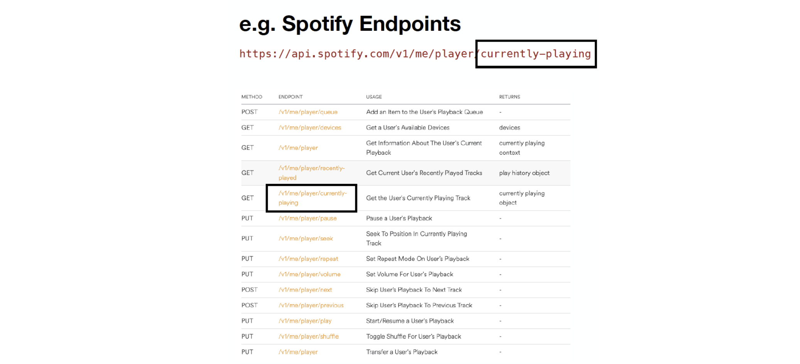
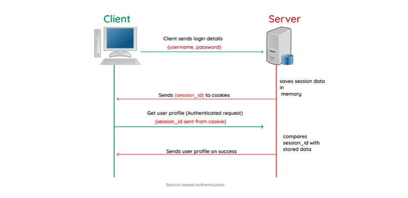
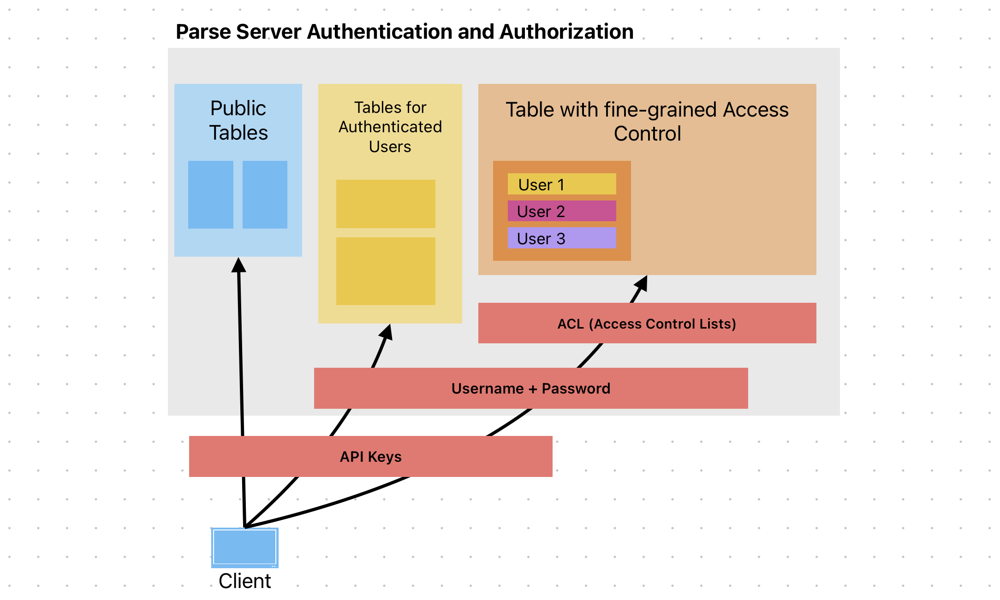

# APIs 

## **What is an API?** 
- *Application Programming Interface* -- a generic term referring to an *interface to a system*
- the interface is usually made up of 
	- a collection of functions
	- conventions of usage for those functions
- the ***system*** about whose interface we talk about can be
	- a class (e.g. the [Array API](https://www.javascripture.com/Array) in Javascript)
	- a package (e.g. [Java Concurrency API](https://www.datasciencecentral.com/developing-multi-threaded-applications-with-java-concurrency-api))
	- an application (e.g., the [web browser API](https://developer.mozilla.org/en-US/docs/Web/API) implemented  by modern browsers)
	- a web service: (e.g. [Spotify API](https://developer.spotify.com/documentation/web-api), [Twiter API](https://developer.twitter.com/en/docs/twitter-api))


### Focus: Browser APIs

**What are some of the most important browser APIs that can be used by Javascript Applications?**
- Web Storage API
- Fetch API


##### **How do you use the `fetch` web browser API to download a json document from a web service?**
```js
fetch("<uri>")
	.then(response => response.json())
	.then(data => console.log(data));
```
- What kind of object is returned by `fetch`? What about `json()`. How do you know? 


##### **What is the main way to interact with the Web Storage API?**
```js
LocalStorage.save("UIColorScheme", "dark")
...
LocalStorage.get("UIColorScheme")
...
```


### Focus: Web Service APIs

**Interfaces** for interacting with **remote servers** by using **web technologies** (HTTP)

They goal is to enable a **client** to exchange data with a **remote server**

The **client** can be
- a web application running in the browser (on your laptop or phone)
- a native application (e.g. the Spotify app)

The **server** can be:
- your own server (e.g. `api.zeeguu.org` for `zeeguu.org`) 
- A 3rd party API (e.g. Spotify, Twitter, OMDB, Google Translate)

The server exposes API **endpoints** following the following conventions
- communication is done via HTTP 
- data is usually returned in JSON format
- the version of a service is usually encoded in the URL 



#### REST APIs 

A special case of Web Server APIs that follow a strict convention for managing resources via CRUD operations (create, read, update, delete).

Proposed by Roy Fielding in his 2000 PhD thesis based on the observation that HTTP verbs can be mapped on CRUD actions


Conventions
- text based protocol (JSON, XML)
- strict endpoint naming, see example below
- HTTP verbs are mapped on CRUD actions

Parse offers as an alternative to the JavaScript API that you've been using until now also a REST API. In a system that manages objects of type `Translation`, the way to get a list of translations is done from the command line as in the following: 

```bash
curl -X GET \
  -H "X-Parse-Application-Id: Al7ZSSh904iWQjRfzaz9A0EzFS7YSFLE6xdbvOgm" \
  -H "X-Parse-REST-API-Key: f6GeVUvMTJfkrdVZ0Vkh1lWbwQ0Z9kpV7CEJdPRg" \
  https://parseapi.back4app.com/classes/Counter
```

To understand the command 
- `curl` - linux based terminal-based tool used for sending HTTP requests 
- `-X` specifies the HTTP verb to be used by `curl`
- `-H` specifies headers (in our case, we send two headers that identify us)


A REST API can be called from the command line as above, but normally it is called from within the programming language. Below you have an example of creating a new counter object and uploading it to the above application. Since we are creating a new object, we use the `POST` HTTP verb:

```js

const postData = {
    name: "biking distance (in km)",
    to: "10",
  };

  try {

    const response = await fetch("https://parseapi.back4app.com/classes/Counter/", {
      method: "POST",
      headers: {
        "X-Parse-Application-Id": "Al7ZSSh904iWQjRfzaz9A0EzFS7YSFLE6xdbvOgm",
        "X-Parse-REST-API-Key": "f6GeVUvMTJfkrdVZ0Vkh1lWbwQ0Z9kpV7CEJdPRg",
      },

      body: JSON.stringify(postData),

    });

    if (!response.ok) {
      const message = "Error with Status Code: " + response.status;
      throw new Error(message);

    }
    
    const data = await response.json();
    console.log(data);

  } catch (error) {
    console.log("Error: " + error);
  }
```

TODO in class: 
- Run this code with node
- Run a GET request

##### Relationship between the `Parse` object and the Parse REST API
- The `Parse.Object` and `Parse.Query` objects are built *on top of* REST calls
- They expose to you the programmer a nicer and simpler interface
- You could always simply use the REST API with fetch w/o the `Parse.Object` and `Parse.Query`


## Two Challenges When Designing Web Service APIs

The main two challenges are: 
1. **Authentication** - How do you ensure that only the callers you want use your endpoints?
2. **Authorization** - How do you ensure that a user does not overreach? 

### Authentication

#### API keys
Most popular solution for authentication when your application needs to be using a third-party API (e.g. Google Translate, Spotify API, Twitter API, etc.)

How does it work? 
- API Key = Unique generated value is assigned to a user
- Key is sent with every request 
- Authentication key is to be kept secret


Why? 
- Faster than always sending username / password
- Easy to revoke in case user access should be terminated

Example: If you go to [omdbapi.com](omdbapi.com) and get a key, then you can get information about a given movie as below: 

```js
fetch("https://www.omdbapi.com/?t=guardians%20of%20the%20galaxy&apikey=955936f0")
  .then(response => response.json())
  .then(data => console.log(data));
```


#### Session Based Authentication
Most popular solution for authenticating users in a client-server architecture

Addresses the limitations that come with the stateless nature of HTTPS 

Session secret key is generated after login on the server, stored in the cookie, and from then on sent always back to the server with every request. 




### Authorization (in Parse)

#### **What happens if I access your repository and find your AppID and JSKey?** 
- I can add fake data
- read info that is not meant for them
- store their movie collection in your tables
- delete useful information


#### **How could this be?**
When we created the DB we were asked about access control and we agreed to make everything public because we're working on an MVP. Now it's time to harden the security of our database
#### How to avoid the above situations? 
First order of business
- use .env to keep variables locally and not publish them on GH

Second order of business
- introduce access control so even if somebody discovers the keys, no harm can be done 

#### **Why can you not keep the Parse API keys perfectly secret?** 
- Remember the architectural diagram from the beginning of the course? bundle.js is sent to the browser... 
- The JavaScript code of your web application can be inspected by another web programmer. 


#### **What can we do if the API keys can't be made secret?** 
- Limit access to tables
- Restrict class creation
- Limit access to individual objects

Let us take each of these in turn.

##### Limiting Access to Tables

For every table you can choose who has access to it and what privileges they have

Who has access can be specified with multiple levels of granularity
- public
- authenticated users
- specific users 
- etc. 

Privileges can be 
- reading
- writing 
- even more specific column level permissions

Image below shows the Parse UI for setting Class-level permissions. 


E.g.: So for your applications, you would very likely not want non-authenticated users to access your tables. 


##### Limiting Access to Objects

Even if now you only allow logged in users, it would still not be desirable that an unfriendly user creates an account and then starts deleting other people's data. In fact, you very likely do not want them to read other people's private data either. 

This is where the Access Control Lists concept come into play. They allow you to set fine-grained permissions for every row in your table. Usually they are created at the creation time of an object.

In the following example, a logged in user, creates a private note and ensures that it is only himself that can access that note: 

```js
const Counter = Parse.Object.extend("Counter");
const privateCounter = new Counter();
privateCounter.set("name", "Times Checked Twitter");
privateCounter.set("counte", "42");
privateCounter.setACL(new Parse.ACL(Parse.User.current()));
privateCounter.save();
```

However, it is sometimes desirable that an object can be **read by other users**, but just **can not be written by them**. For such a case the `Parse.ACL` object offers the `setPublicReadAccess(true)` method call:

```js
const Post = Parse.Object.extend("Post");
const publicPost = new Post();
publicPost.set("content", "I love technical interaction design");
publicPost.setACL(new Parse.ACL(Parse.User.current()));
publicPost.setPublicReadAccess(true);
publicPost.save();
```

Access control lists can be modified every time an object is saved. 

##### Restricting Class Creation

Under `App Settings > Server Settings > Client Class Creation` you can specify if your expect users to be allowed to create new classes in your database. Probably you do not want that. 

#### Combining Authorization Methods to Harden the Security of an Application

The methods above should be combined together to strengthen the authorization of your application. 




# For your projects
- harden security of your app by adding access control 

# Reading
From the ParsePlatform.org Guide:
- [Class-level Permissions](https://docs.parseplatform.org/js/guide/#class-level-permissions)
- [Object-level Access Control](https://docs.parseplatform.org/js/guide/#object-level-access-control)


# Not discussed in the course
- role-based access control


