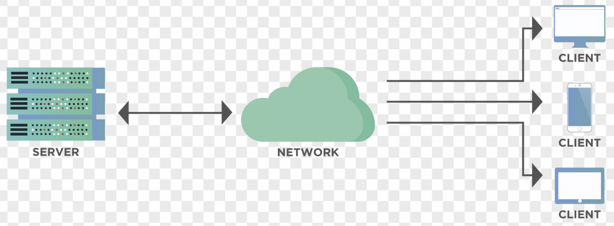
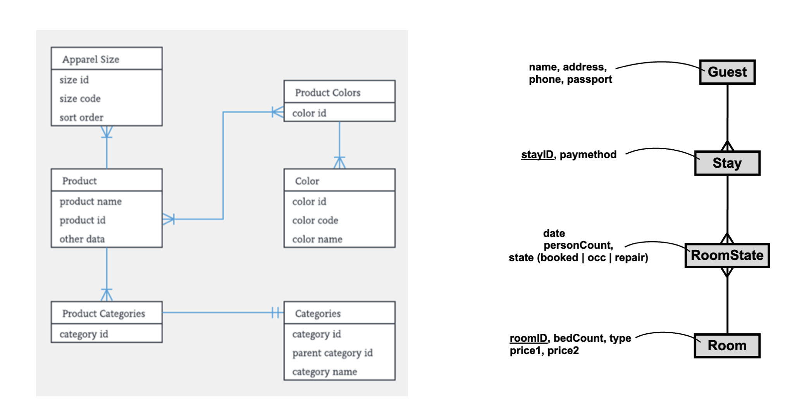

# Backends and the Parse Platform

## Backends

- What is a backend?
	- Defined in opposition to the front-end
	- The server side in a ***client-server architecture***



- What are the **responsibilities of the backend**?
	- authentication (proving that a user is who they say they are)
	- session management for web applications
	- business logic and DB access
	- authorization (what can a user do)
	- scheduled jobs (e.g., `cron`)

- Deploying and implementing a traditional backend
	- machine setup (or create a VM with a cloud provider)
	- operating system
	- security & firewall
	- install DBMS
	- web server (e.g. nginx, apache2)
	- develop an (REST, Web) API 
	- logging and analytics
	- backup system


- **Low-code backends**
	- Common solutions for common backend problems
	- Alternatives, e.g.:
		- Firebase = proprietary & hosted by Google
		- Azure = Microsoft’s version 
		- **Parse Platform** = open source 


## Parse Platform

Our recommended low-code backend
- Implementation language
	- JS 
	- Runs on Node
- History
	Startup => Facebook => open source
- Functionality
	- Authentication
	- Authorization
	- File storage
	- APIs (REST & GraphQL)
	- Javascript SDK in the `parse` wrapper library
	- Cloud functions


### Using Parse from Back4App

- Where is the Parse server?
	- You can run on your own machine (with docker; setup can be complicated)
	- In your own (cloud) server
	- On somebody else's server (cloud) => back4app.com 


Steps to start working with the Back4App Parse deployment 
1. Create an account on Back4App
2. Create a backend (app) for your react application in Back4App
4. In your own project, install the `parse` library from `npm`
5. Initialize the (global) Parse object in your application (see step 4 in the [back4app guide](https://www.back4app.com/docs/react/quickstart))
 
Now you can interact with the database from within React in the following ways: 

### Saving a New Object to the Database

```javascript

import Parse from 'parse';

const Counter = Parse.Object.extend("Counter");
const counter = new Counter();

counter.set("name", "Push Ups");
counter.set("count", 10);

counter.save().then(
	(newObj) => {
		alert("saved a counter with id: " + newObj.id);
}, (error) => {
	alert(error.message);
})
```

Note: 
- Creating a class for the object
- `save()` - sends the data to the server
- `save.then( (obj) => {...})` - save returns a *promise*
- The `Counter` class would have automatically been created in the database if it didn't exist

### CRUD Operations with Parse 

**CRUD** stands for **Create, Read, Update, and Delete**
- these are the operations that your UI might want to do with a given domain object 

*To DO*: [CRUD operations with Parse](https://www.back4app.com/docs/react/data-objects/react-crud-tutorial) (30min read)


### User Management with Parse

Parse Object SDK helps you manage user accounts easily. 

Read up on it here: 
- [User Creation](https://www.back4app.com/docs/react/working-with-users/sign-up-page-react)
- [User Login](https://www.back4app.com/docs/react/working-with-users/react-login)


### Modeling Domains with Parse

To be able to design a model for your application domain you must understand: 
- [Basic Data types](https://www.back4app.com/docs/react/data-objects/react-data-types) (estimated reading time:  15min)
- [Relationships](https://www.back4app.com/docs/react/data-objects/relationships) (on Back4App.com estimated reading time: 30min)

In the Relationships tutorial observe that they first designed an ER diagram before declaring the classes in the Parse UI. You should do the same about your app. 

In their ER diagram they also only show the main entities and relationships. This is the most basic information. However, normally you also show the attributes of the various entities. 

There are many ways in which the attributes can be shown. Below you have two: 
1. on the left hand side is the most popular way of showing attributes
2. on the right hand side is a compressed approach proposed by Søren Lauesen, ex-professor at ITU



No matter which notation you use, the most important aspect is being able to communicate the way all the relevant data for your application domain is saved in the database. 

Note: 
- The [Relationships](https://docs.parseplatform.org/js/guide/#relations) section at ParsePlatform.org has a more basic documentation on relationships than the back4app one. 


## Project Work
- Design a **domain model** for your application by **creating an ER diagram**. The diagram will be part of your final report. Discuss your diagram with the staff. Make sure to keep it up to date as your project progresses. As you work on your implementation you will realize that you need to constantly refine it. Keep it up to date.
- Create the tables corresponding to your ER diagram in Back4App
- Start connecting your React application to your own Parse backend

## Individual Work

- can you implement `handleDeleteClick` in ... https://github.com/itu-tid/code-examples/releases/tag/with_basic_parse_backend 


# References

Two complementary documentation sources: 
1. The documentation at Back4App.com
	- [React Quickstart Guide](https://www.back4app.com/docs/react/quickstart) <-- example of setting up a basic react application
	- [Method reference](https://www.back4app.com/docs/react/data-objects/react-query-cookbook#cwx91) for the `Parse.Query` class:
		- [retrievers](https://www.back4app.com/docs/react/data-objects/react-query-cookbook#7gYWf) (e.g. find, findAll, first)
		- [conditions](https://www.back4app.com/docs/react/data-objects/react-query-cookbook#7tu0z) (e.g. contains, lessThan, etc.)
		- [ordering](https://www.back4app.com/docs/react/data-objects/react-query-cookbook#3Tc5v) (e.g. ascending, descending)
		- [field selecting](https://www.back4app.com/docs/react/data-objects/react-query-cookbook#88HKH)(e.g. exclude, include)

2. The documentation on ParsePlatform.org
	- [Getting Started Guide](https://docs.parseplatform.org/js/guide/#getting-started) -- focuses solely on the Parse Platform aspects - disentangled from the React aspects
		- [Users](https://docs.parseplatform.org/js/guide/#users) -- login, user creation
		- [Relationships](https://docs.parseplatform.org/js/guide/#relations) - this is very good and must be read attentively -- it will really help with modeling


# Meta
## History
- Nov '24 - better organized the references
## To Do
- make sure to spend more time discussing the Relationships