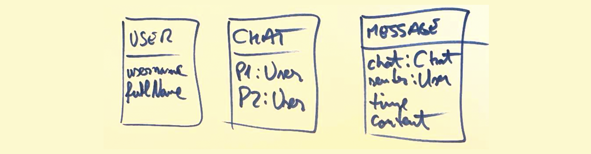

- Access Control - not essential? 

- What do we save in LocalStorage and what do we save in the DB? 


## Single Page Application Architecture


Advanced DB topics
	- [Live Queries](https://www.back4app.com/docs/react/real-time/react-hook-real-time)
		- how to get notified when data changes 


### A bit about APIs
- https://rickandmortyapi.com/ 
- you can see by example:
	- REST
	- GraphQL
- you test them with Postman
- you also test them with the help of the `fetch` API


## Advanced Questions / To Think About

1. What happens when one sends a full url straight to the server? e.g. zeeguu.org/exercises? 


# Single Page Applications

#### What are Single Page Applications (SPAs)? 

#### Why are they useful? 

#### What's the relationship between the client-server architecture and SPAs?


#### How to protect some routes if the user is not loggedIn? 


Git
- what do you not commit to git?
- what is a fork? 


**From the React Tutorial**
Managing State (subsections)
- Choosing the State Structure (Principles for structuring state)
- Sharing State Between Components
- Preserving and resetting state (quite detailed about component state lifetime)
- Extracting state logic into a reducer (command pattern)
- Passing data deeply with context

Escape Hatches (subsections)
- useRef
- manipulating the DOM with Refs
- Synchronizing with Effects


- [Forwarding props with the spread syntax](https://react.dev/learn/passing-props-to-a-component#forwarding-props-with-the-jsx-spread-syntax)
- [Passing JSX as children](https://react.dev/learn/passing-props-to-a-component#passing-jsx-as-children)


See the example from: [Sharing data between components](https://react.dev/learn#sharing-data-between-components)
- moving the state up is also calling *lifting the state*

Advanced: A special kind of prop is the `children` prop that, when used inside of a component definition refers to the JSX contained in the component. [Read and see example](https://react.dev/learn/passing-props-to-a-component#passing-jsx-as-children)

Hooks


- Reactive programming - as opposed to declarative programming
	- [Reacting to Input with State](https://react.dev/learn/reacting-to-input-with-state) (from react.dev)


- [Updating Objects in State](https://react.dev/learn/updating-objects-in-state)
- [Updating Arrays in State](https://react.dev/learn/updating-arrays-in-state)

- UI Patterns
	- Rendering a list of elements 


## Designing with Components

One possible process: 
- Breaking the UI in a component hierarchy
- 


Fundamental React: when a prop is changed, the component is also redrawn (reactive programming). See the [clock example](https://react.dev/learn/passing-props-to-a-component#how-props-change-over-time). 


# Querying the Database

Take the following database model: 



In it, `p1` and `p2`, and `sender` are of type `Pointer` pointing to the `User` class. And `chat` is a pointer to the `Chat` class. 

Let us assume that we have a component named `ListOfChats` that aims to list all the chats. Since the logged in user can be accessed with the `Parse.User.current()`, one could use the following implementation to get all the chats in which the current user is `p1`: 

```javascript

function ListOfChats() {

	// define the state var in which we keep the chat list
	const [chatList, setChatList] = useState(null);
	const currentUser = Parse.User.current();

	// load the chat info when component is rendered first time
	useEffect(() => {  
	    loadChatData();  
	}, []);


	// actual data loading from the DB 
	async function loadChatData() {  

	    let query = new Parse.Query("Chat");  
	    query.equalTo("p1", currentUser);  
	  
	    let listOfChats = await query.find();  
	  
	    setChatList(chats);  
	};


	if (chatList === undefined) {
		return "Loading..."
	}


	return (
		<>
		{chatList.map(chat => {chat.id})}
		</>
	)
	}

```


Now because rendering the `id` of a chat is meaningless, and because our chat model has no other information besides the pointers to the participants `p1` and `p2` what we want to render is in fact, the name of the other participant to the chat. If we only show the chats were we are participant `p1`, then we could try to render the `fullName` of `p2`. One way to try to do this, is with the following code, that fails:  

```js
	return (
		<>
		{chatList.map(chat => {chat.get("p2").get("fullName")})}
		</>
	)
	
```

The reason for this failure is that our query object has only retrieved from the DB info in the Chat table. Thus, we do not have access to the `fullName` info in the `User` table. To access that, there are three alternative ways: 

### Alternative 1

One possible way to do that is to make another query to the Database for each chat. Since queries return promises, this results in quite a challenging dance of async/awaits. 

More precisely, for each chat object retrieved by `find` we are making a new query to the DB to get the `fullName` for the corresponding `p2` user: 

```js
	// actual data loading from the DB 
	async function loadChatData() {  

	    let query = new Parse.Query("Chat");  
	    query.equalTo("p1", currentUser);  
	  
	    let listOfChats = await query.find();  

	    let chatUsernamePairPromises = listOfChats.map(async chat => {
		
			let userQuery = new Parse.Query("User");
			userQuery.equalTo("objectId", chat.get("p2").id);
			
			let user = await userQuery.first();

			// returning a new kind of object that mixes the 
			// and the username of the person we're chatting to
			return {id: chat.id, name: user.get("fullName")}
			
		})

	    let chatUsernamePairs = await Promise.all(chatUsernamePairPromises);

	    setChatList(loadChatData);  
	};


```

Notes
- The lambda function inside of the call to `map` ...
	- ... is an anonymous `async` function, because inside it we have to do call `await` for every query for the details of every User object linked in the 
	- ... uses the `first()` query function instead of the `find()` because we know for sure that we have a single  object that matches our query (there can only be one user with a given id). When we call `find()` we get an array of objects; when we call `find()` we get a single object.
	- ... returns a list of promises!!! (because every async function always returns a promise)
- Before we can set the state variable with `setChatList` we have to make sure that all the promises in our list of promises have finished. To do that we call the `await Promise.all(...)` function as in the example
- If you understand this, then you will never be afraid of `async/await` ever again. 


### Alternative 2

Parse has a more elegant solution to the problem above. Instead of us going to the database for every chat object with a new query, we can ask the API it to retrieve also details for Pointer objects. In our case, because we only care about `p2` we ask it to include objects pointed at by `p2` in the following way: 

```js
	async function loadChatData() {  

	    let query = new Parse.Query("Chat");  
	    query.equalTo("p1", currentUser);

	    query.include("p2"); // <--- the magic line
	  
	    let listOfChats = await query.find();  
	  
	    setChatList(chats);  
	};
```

Now we can use the following line of code for getting the fullName

```js
chat.get("p2").get("fullName")
```

### Alternative 3
Another approach to the example above, is to move the getting of the information about the Chat into its own separate component. In that case, the `ListOfChats` component becomes simpler and leaves to the individual `Chat` element the responsibility for querying the DB for the user's `fullName`:  

```js

const ListOfChats = () => {  
  const currentUser = Parse.User.current();  
  const [chatList, setChatList] = useState();  
  
  useEffect(() => {  
        loadChats();  
    }, []);  
  
  async function loadChats() {  
        let query = new Parse.Query("Chat");  
        query.equalTo("p1", currentUser);  
        let listOfChats = await query.find();  
        setChatList(listOfChats);  
    };  
  
  if (chatList === undefined) {  
        return ("Loading...");  
    }  
  
  return (  
    <div>  
        <h4>Recent chats</h4>  
          {chatList.map(chat => <Chat chat={chat}/>)}  
    </div>  
  )  
}
```

And the responsibility of getting the username for a given chat, is delayed till the first rendering of the `Chat` component as shown below: 

```js

function Chat({chat}) {  
  
    const [username, setUsername] = useState();  
  
    async function loadUsername () {  
        let userQuery = new Parse.Query("User");  
        userQuery.equalTo("objectId", chat.get("p2").id);  
        let user = await userQuery.first();  
        setUsername(user.get("fullName"));  
    }  
  
    useEffect(() => {  
        loadUsername();  
    }, []);  
  
    if (username === undefined) {  
        return <small>loading</small>  
    }  
  
    return (  
        <div>  
            <a href={"/chats/"+chat.id}>{username}</a>  
        </div>  
    )  
}

```

and the ChatListPage would simply delegate to the `Chat` component as below:
In our example, this is still sub-optimal because we are sending more queries than necessary to the DB. However, in other situations this might be a solution. 