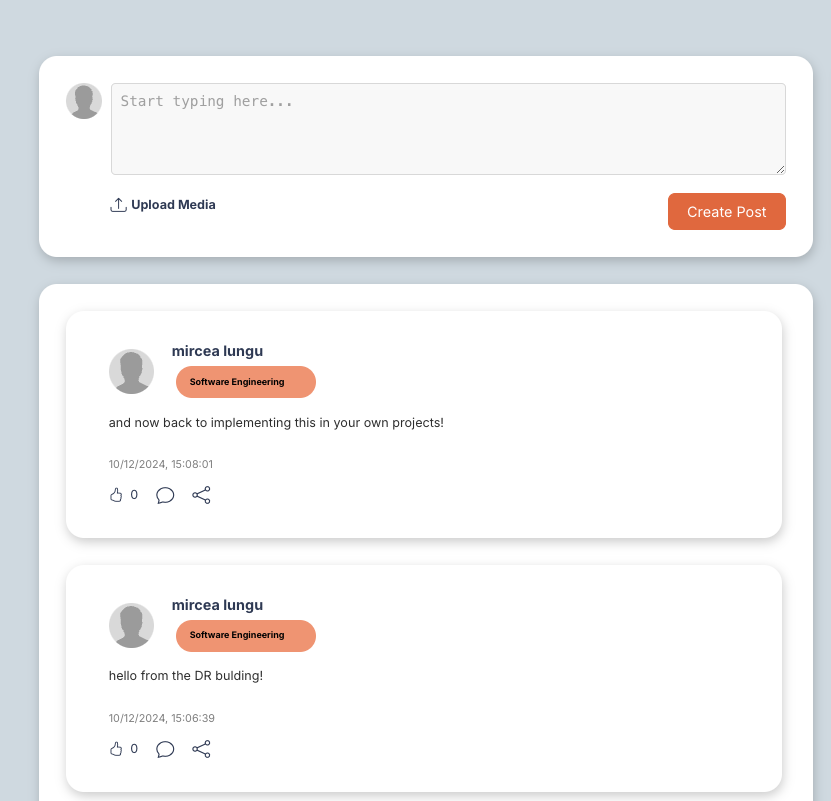

# Updating a List in a Parent Component from a Child Component

Imagine the situation when you have a list of posts on a social media site, something like in the example below: 



You want to update the list in the parent component which might be called `Home` from the child component, which might be called `PostingContainer`. 

The parent component would look something like the code below:
- it would have a state variable called posts
- it would render the `PostingContiner` and then the list of posts

```js

function Home {  
  const [posts, setPosts] = useState([]);  
  
  return (
    <>
      <PostingContainer></PostingContainer>	  
      
      {posts.map((post, index) => {
        return (
          <Post postObject={post}/>
        )
      })
    </>
  )
```

In your design, it is the `PostingContainer` that is responsible with creating a new post and publishing it to the database. There are two ways in which you can, from that component, update the list in the parent. 

## Pass both the `posts` and the `setPosts` to the child container so it can append the new 

```js

function Home {  

  const [posts, setPosts] = useState([]);  

  return (
    <>
      <PostingContainer posts={posts} setPosts={setPosts}></PostingContainer>	  
      {posts.map( // ... 
      })
    </>
)
```

Inside of the `PostingContainer` you can then update the posts once the new post object has been added to the database, something like this: 

```js
function PostingContainer ({posts, setPosts}) {

  function createPost() {  
  
    let newPost = new Parse.Object("POSTS");  
  
      newPost.set("text", text);  
      // save everything else from this post
      // ...
      await newPost.save();  

      setPosts([newPost, ...setPosts]);
};

```

However, this is not smart, because you're sending the whole information about the posts to the child component. The state should really be local to a component, just as attributes are local to a class. Why is this a bad idea? 


## Pass a callback function that can add a post to the list

A smarter alternative is below: 
```js

function Home {
  const [posts, setPosts] = useState([]);  

  function addPostToList(newPost) {  
    let newPostsList =[newPost, ...posts];  
    setPosts(newPostsList);  
  }

  return (
    <>
      <PostingContainer addPostToList={addPostToList}></PostingContainer>
		  
      {posts.map( // ... 
      })

    </>
  )
```

Then, in the posting container you simply call the callback method with the newly created object and the addition will eventually happen in the context of the parent. 

```js
function PostingContainer ({addPostToList}) {

  function createPost() {  
  
    let newPost = new Parse.Object("POSTS");  
  
    newPost.set("text", text);  
    // ... 
    await newPost.save();  
    
    addPostToList(newPost);  
  
  }
};
```

Why is this smarter? 