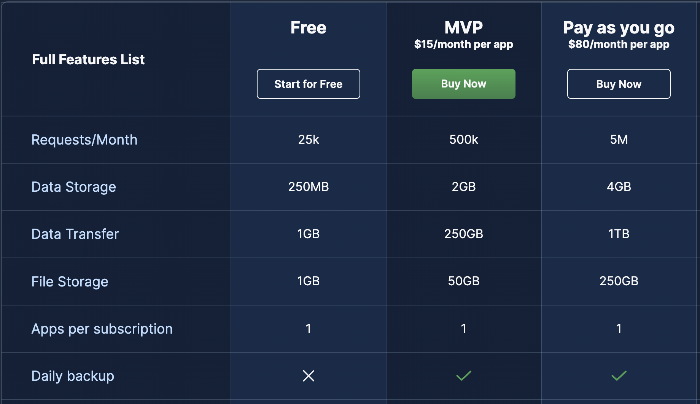
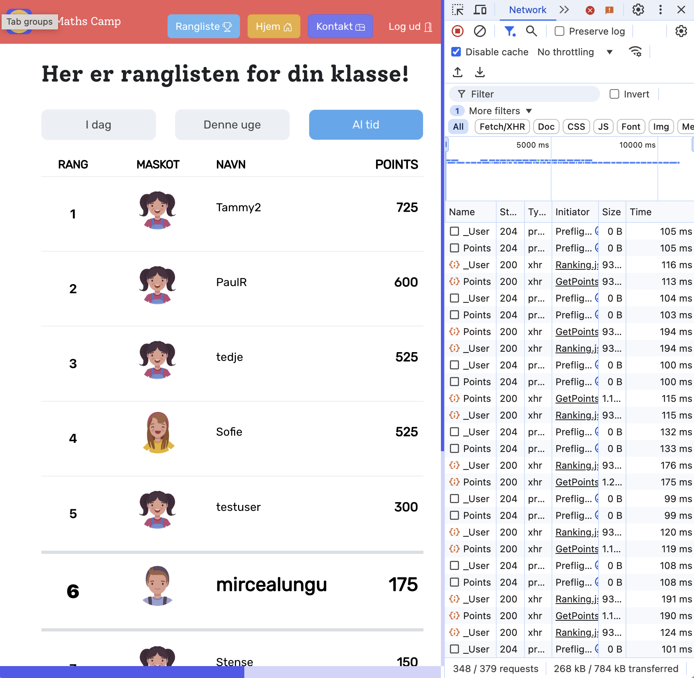

# Efficient Communication With the Backend

The separation between front-end and back-end is new: one used to do web development, and they did everything. 

Today we talk about being a *full stack* developer if you can do both the backend and the front-end. 

It is more satisfying to be full stack. And it's not much harder. This is because front-end is by definition event-driven, concurrent programming. Back-end is usually modeling and querying the DB. 

This is why, it's worth for you, as naturally front-enders to have at least basic knowledge of backend. In this chapter we'll look at a few issues that are relevant for Parse Platform backends, but often will generalize to any kind of backend.

## Being Aware of Costs

Back4App, the hosted service of Parse costs money. You are using a free tier, but you must realize that this is a cloud-based solution. For cloud-based solutions one has to pay. 

Consequently, a free tier will have limitations. The limitations of the Back4App server ensure that you do not put too much pressure on the server. 

The image below shows the prices and limitations of the Back4App various plans. 

In particular for the free tier, you have limited:
- number of requests
- data transfer
- data storage

### How does the fact that you are using a backend-as-a-service impact the design of the communication between your front- and your back-end? 

You have to be smart about resource usage because otherwise you 
- will spend more money
- will have a slower application

#### Case Study: MathsCamp -- looking at the networking tab... why might we need to improve the interaction of this? Is it to save money or is it to have a faster application? 

## Querying the Backend Efficiently

If you have *limited requests* it makes sense to get as much data from the DB in one go, as opposed to run multiple queries. 

This is not a problem only for backends-as-a-service - this is a general problem. If you are not smart about querying your backend you will end up with a slow application. 

### What is the N+1 Select Problem? 

This is one of the most popular ways of using a DB wrongly. 
You send a query, get n objects back, and then for every one of those objects, you send another query to get more information. 

In general it's slower than it needs to be. 
In the particular case of cloud-hosted Parse, it's bad because you're running out of requests faster.

How to solve it? Get all the data at once by *joining* the corresponding tables. This is, retrieving data from two tables at once. 

### How to Retrieve Info From Two Related Tables at Once in Parse?

By default, when you create a `Parse.Query` object you create it for a given table and you get back objects from that particular table. Pointers are retrieved only as the `objectID` of the actual object in the remote table. So normally, you'd have to send another query to bring also the object. To avoid that, you have to use the `include` method of the `Parse.Query` object to specify that you want to include also the objects in the table pointed at by the pointers. 

See [Field Selecting](https://www.back4app.com/docs/react/data-objects/react-query-cookbook#88HKH) -- `include` for an example. 

The corresponding SQL statement is `join`.

### How to Retrieve Only the Necessary Data

Just as sending too many queries is a problem, transferring from the server too much data that is not needed is also a problem. For example, if in a given context you need to list all the names of the `UserProfiles` in your application, it would be a waste of *bandwidth* to transfer everything else, including the profile pictures of these users. 

See [Field Selecting](https://www.back4app.com/docs/react/data-objects/react-query-cookbook#88HKH) -- `exclude`, and `select` as a ways of retrieving only the necessary fields from a table. 

The corresponding SQL statement is `select name from ...`. 

### How to update elements on the screen when they change in the DB? 

For most of the situations, we don't have to update our UIs when the data in the DB changes, because most of the times, a user is editing their own data and nobody else is changing it in the background. 

One notable exception are the situations when a screen is showing information that's created by other users that needs to appear in real time (e.g. messages in a chat application, or comments in a social media platform). 

How does the backend update the front-end? 
#### Polling: The low-tech way
- Set a timer
- When the timer expires, request the data again from the server
- Redisplay if needed
- Make sure to use the special syntax of `useEffect` to cleanup the timer when the component is not visible anymore

#### Event-Driven Approaches: The Advanced Way
- allow the server to send you events when something in your query has changed
- update only when something has actually changed

In Parse, an implementation of this can be done with the `LiveQuery` [protocol](https://github.com/parse-community/parse-server/wiki/Parse-LiveQuery-Protocol-Specification). 

