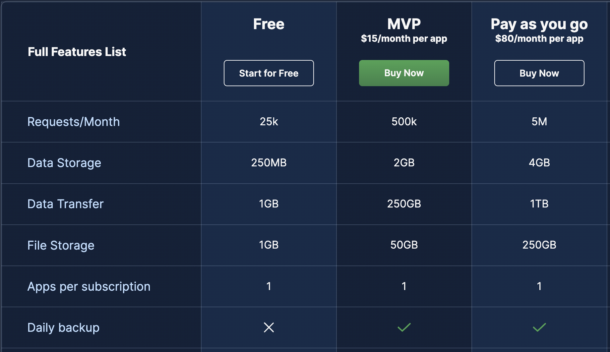
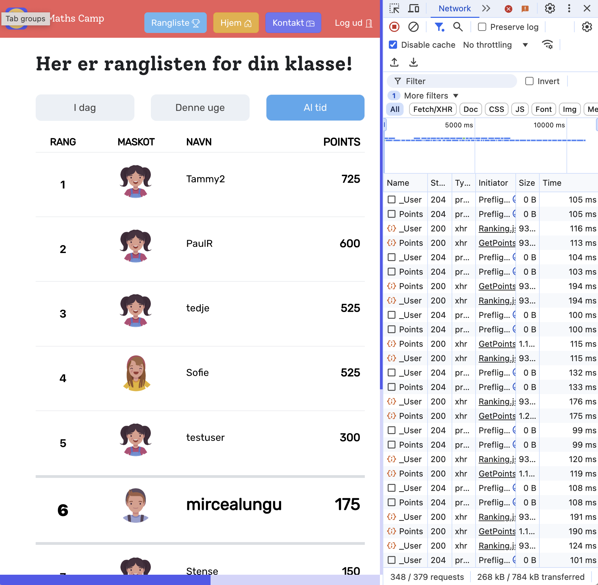

# Efficiently Communicating with the DB

## Being Aware of Costs

Back4App, the hosted service of Parse costs money. You are using a free tier, but you must realize that this is a cloud-based solution. For cloud-based solutions one has to pay. 

Consequently, a free tier will have limitations. The limitations of the Back4App server ensure that you do not put too much pressure on the server. 

The image below shows the prices and limitations of the Back4App various plans. 

In particular for the free tier, you have limited:
- number of requests
- data transfer
- data storage

### How does the fact that you are using a backend-as-a-service impact your application? 

The answer is: you have to be smart about resource usage. 

Case Study: MathsCamp -- looking at the networking tab... why might we need to improve the interaction of this 

## Querying the Backend Efficiently

If you have limited requests it makes sense to get as much data from the DB in one go, as opposed to run multiple queries. 

This is not a problem only for backends-as-a-service - this is a general problem. If you are not smart about querying your backend you will end up with a slow application. 

### What is the N+1 Select Problem? 

This is one of the most popular ways of using a DB wrongly. 
You send a query, get n objects back, and then for every one of those objects, you send another query to get more information. 

In general it's slow.
In the particular case of cloud-hosted-parse, this is also stupid because you're running out of requests. 

How to solve it? Get all the data at once by *joining* the corresponding tables. 

And in Parse?

### How to update elements on the screen when they change in the DB? 

For most of the situations, we don't have to update our UIs when the data in the DB changes, because most of the times, a user is editing their own data and nobody else is changing it in the background. 

One notable exception are the situations when a screen is showing information that's created by other users that needs to appear in real time (e.g. messages in a chat application, or comments in a social media platform). 

How does the backend update the front-end? 
#### Polling: The low-tech way
- set a timer
- when the timer expires, request the data again from the server; redisplay if needed

#### Event-Driven Approaches: The Advanced Way
- allow the server to send you events when something in your query has changed
- update only when something has actually changed

