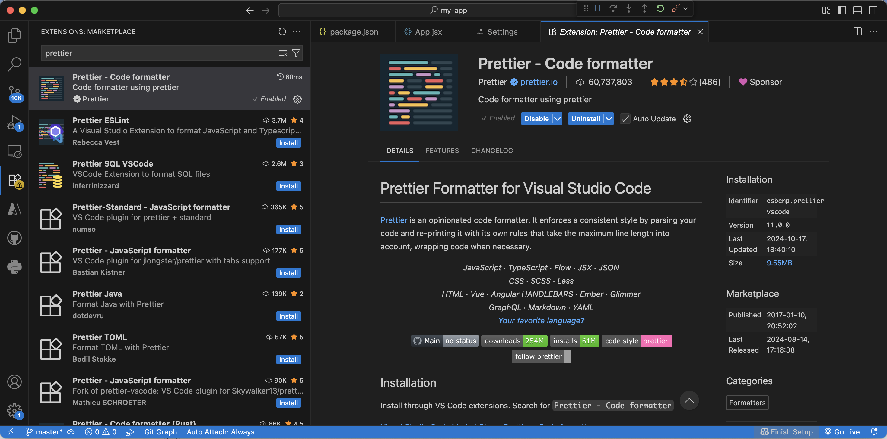
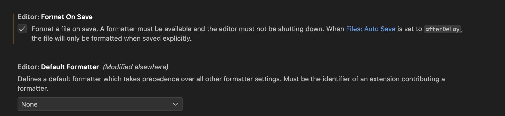
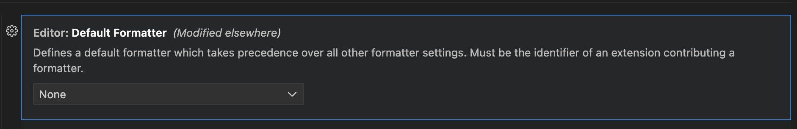

# Start Your First React App with **Vite** and **Visual Studio Code**

## Step 1: Install Node.js
Visit the official Node.js website at https://nodejs.org/en/download/prebuilt-installer

Download and install the latest LTS (Long Term Support )version for your operating system.

Run the installer, following the prompts to install Node.js and npm. You can verify the installation by opening a new terminal window and running:

  ```bash
  node -v
  npm -v
  ```

## Step 2: Create a new React app with Vite
From your terminal, navigate to the folder where you keep projects and run
```bash
# Create a new Vite project

npm create vite@latest my-app -- --template react
```

Note: Replace "my-app" with the project name you want. 

Then install dependencies

```bash
cd my-app
npm install
```

## Step 3: Open the project in VS Code
Open VS Code and use **File → Open Folder…** to select your project.

## Step 4: Run the dev server
```bash
npm run dev
```

Vite prints a local URL like http://localhost:5173 (the port may vary). Open it in your browser to see the starter app.

To stop the server, press **Ctrl + C** in the terminal.

## Step 5: Project Structure (what you get)
A new Vite + React app looks roughly like this:

```
my-app/
├─ node_modules/
├─ public/
├─ src/
│  ├─ assets/
│  ├─ App.jsx (or App.tsx)
│  ├─ main.jsx (or main.tsx)
│  └─ index.css
├─ .gitignore
├─ index.html
├─ package.json
├─ vite.config.js (or vite.config.ts)
└─ README.md
```

Key files:

* **`index.html`**: Vite’s HTML entry point.
* **`src/App.jsx`**: Starter component — edit here to start building.

## Step 6: Install Prettier for formatting
Download the **Prettier** extenstion: https://marketplace.visualstudio.com/items?itemName=esbenp.prettier-vscode 




Go to settings, and search for "Format". Make sure you click the "Format on Save".



If possible, choose the "Prettier - Code Formatter" in the "Default Formatter". 



If you don't see Prettier here, open a random jsx-file and do this via the command:

**Cmd/Ctrl+Shift+P** → **Format Document With...** → **Configure Default Formatter** → choose **Prettier - Code Formatter**

Reload the window with **Cmd/Ctrl+Shift+P → Developer: Reload Window**.


## Step 7: Build for production (optional)
When you're ready to deploy your app or test it in a production-like environment, you'll need
to build it. Building the app optimises it for performance and creates a build directory with
all the files necessary to run the app.
In your terminal, ensure you're in your project directory.
Run the following command:

```bash
npm run build
```

This creates a build directory in your project with static files that are optimised for
performance. These are the files you'll use to deploy your app.
Note: The build process minifies your code (reduces the size of the code), bundles it
(combines multiple files into one), and optimises it in other ways for production. The
resulting code is harder for humans to read, but shorter, which makes your app load 
faster for your users.


## Quick Commands Recap

```bash
# Create app
npm create vite@latest my-app -- --template react
cd my-app && npm install

# Dev
npm run dev

# Build
npm run build
