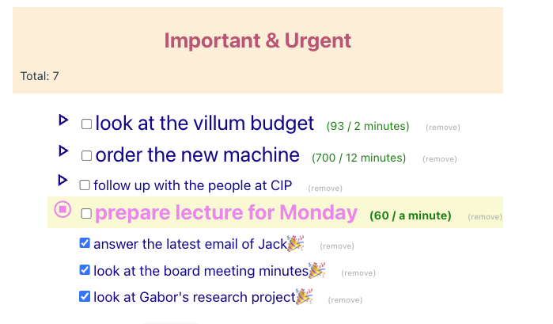

## Bug: task duration disappears when i check an item as done

```js
function handleCheckbox(element_id) {

	let newList = list.map((e) => {
	return e.id == element_id ? 
		{ id: e.id, name: e.name, done: !e.done } : e;

});

const sorted = newList.sort((a, b) => a.done - b.done);
setList(sorted);
}
```


### Explanation

It's fragile if we copy the object with all the fields explicitly.

```js
function handleCheckbox(element_id) {
	let newList = list.map((e) => {
		return e.id == element_id ? 
			{ ...e, done: !e.done } : e;
	});
	const sorted = newList.sort((a, b) => a.done - b.done);
	setList(sorted);
}
```
- See: [T6-Updating Objects and Lists in State](T6-Updating%20Objects%20and%20Lists%20in%20State.md)


# The need for useRef
- i need to track the timer reference to clear it up when component is unmounted
- See: [T7-React-the-useRef-Hook](T7-React-the-useRef-Hook.md)


# Updater functions for state

**Updater Function** example
```js
  export defult function Counter() {
  
    const [number, setNumber] = useState(0)
  
	  return (
	    <>
	      <button onClick={() => {
	        
	        // updater function that takes a callback
	        // all the ones below are the same!
	        setNumber(x => x + 1);
	        setNumber(n => n + 1);	        
	        setNumber(number => number + 1);	
	                
	        // direct update of variable
	        // although you call it three times,  value is incremented with 1!
	        setNumber(number + 1);
	        setNumber(number + 1);
	        setNumber(number + 1);
	      }}>+1</button>
	    </>
    }

```
- difference is between passing a callback and an actual value to the react state updater
- the updater will do this work at a later point, we don't control when that happens


## Why would you use this
- [Queueing A Series of State Updates](https://react.dev/learn/queueing-a-series-of-state-updates)
- When a lambda function risks capturing a stale state


## The importance of refactoring
- as you're working you are in creating mode; just as when you write an essay
- once you're done you have to enter review mode and fix things

