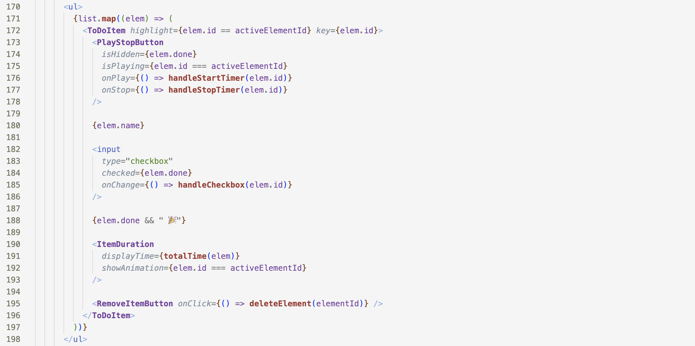

# Refactoring by Extracting Components

- refactoring is critical for having a codebase that is maintainable and pleasant to work with
- extract components 

### Principle: Make sure that the code in a component is at the same abstraction level

Compare the following two code snippets from our ToDo list component that have exactly the same behavior. Which of them is easier to read? 

### Version 1

### Version 2 

- this version allows us to think in terms of the UI elements that are all at the same abstraction level - the play/stop button, the name of the todo list item, its duration, the remove button.
- the previous version was at all possible abstraction levels
	- play button 
	- maths computation
	- css details
	- etc. 

