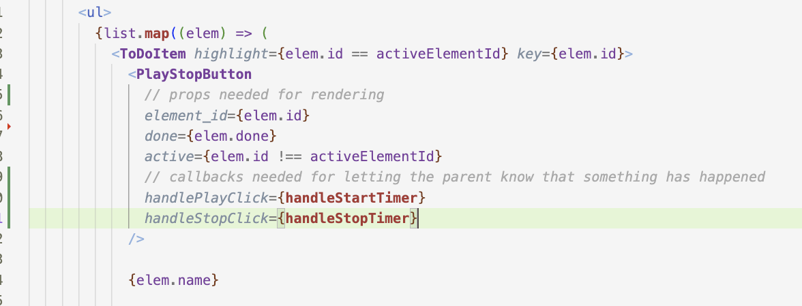

# Patterns of Component Communication
## parent to child = via props

- parent can send information to the child via props

## child to parent = via callbacks
- child does not even know who the parent is (imagine a button, it does not know, and it should not know who uses it)
- but the parent will give it callbacks and it can call them, effectively communicating to the parent

## sibling to sibling by "*lifting the state*"

Sometimes, you want the state of two components to always change together. 

To do it, you _lift the state up_:
- remove state from both of them
- move it to their closest common parent, and then 
- pass it down to them via props

This is a common thing you will do when writing React

**Example**: in the TODO list application, ensuring that one can't start two tasks in two different lists

**To read for next time**: [Sharing state between components](https://react.dev/learn/sharing-state-between-components)
- talks about lifting state with an example

