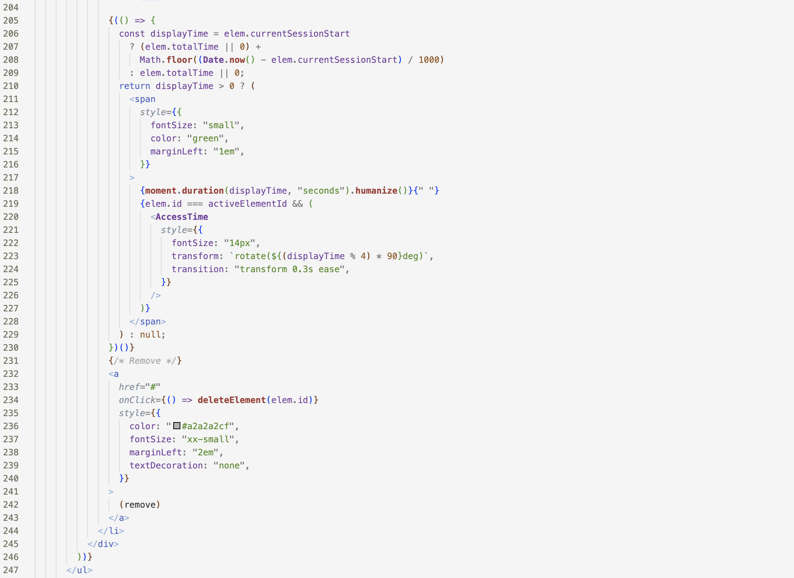

# Refactoring by Extracting Components

**Lesson:** refactoring is critical for having a codebase that is maintainable and pleasant to work with

### Challenge: Compare the following equivalent versions of code

- They have **exactly the same behavior**: rendering items in the todo list
- Which of them is easier to read? 

#### Version 1

#### Version 2 

- this version allows us to think in terms of the UI elements that are all at the same abstraction level - the play/stop button, the name of the todo list item, its duration, the remove button.
- the previous version was at all possible abstraction levels
	- play button 
	- maths computation
	- css details
	- etc. 

### Principle: Code in a component should be at the same abstraction level

### Advice: iterate. iterate. iterate
- there is no way to arrive to simple code without a lot of iteration

### Advice 2: first make it work. then refactor it and make it nice
- you never get it right from the first time

