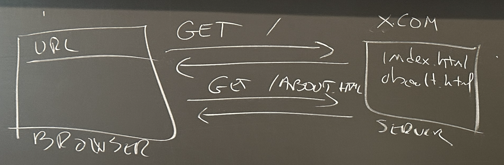

# Brief History of Web App Architectures

# What is a server? 
## A server can refer both to a device in a datacenter but also a special kind of process 

- Example HW server: *our server is an AMD machine with 64GB of RAM* 
- Example of SW server: *the Apache web server listening on port 80*

To eliminate the confusion we are going to refer to ***web server*** or **machine** when we talk about the two types. 

# Three generations of web applications
## First generation of web applications were simple HTML pages

The web server was simply sending a file back

- How?
	- server parses the URL
	- then returns page

## 2nd generation web application uses scripts on the server to generate pages on the fly

the example in the image below shows how different pages are generated when the client (browser) sends a request by using a parameterized `GET` request (e.g. `GET /search?term=shoes`)

- server calls the right program, which
	- generates the HTTP response
	- returns it to the server
	- server sends the response forward to the client
- for the client it looks like it asked for a file and it got a file; but in practice the content was **dynamically generated** 
- as opposed to **static content**

## 3rd generation are Single Page Applications

The example in the image below shows that the server now sends both an `index.html` and a React-generated `bundle.js` that's imported from it to the client. The whole application logic is in the `bundle.js` file and is generated by a compilation process on the server. 

- The SPA is only calling the web server to ask for data 
- The UI is rendered on the client with React

### React is just one of many frameworks that use the SPA architecture

# How do we handle multiple pages if we only have one?

