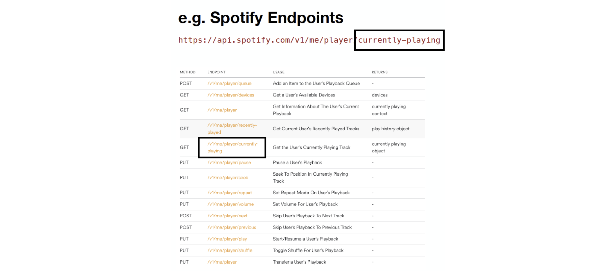

# Web Service APIs 

## **What is an API?** 
- *Application Programming Interface* -- a generic term referring to an *interface to a system*
- the interface is usually made up of 
	- a collection of functions
	- conventions of usage for those functions
- the ***system*** about whose interface we talk about can be
	- a class (e.g. the [Array API](https://www.javascripture.com/Array) in Javascript)
	- a package (e.g. [Java Concurrency API](https://www.datasciencecentral.com/developing-multi-threaded-applications-with-java-concurrency-api))
	- an application (e.g., the [web browser API](https://developer.mozilla.org/en-US/docs/Web/API) implemented  by modern browsers)
	- a web service: (e.g. [Spotify API](https://developer.spotify.com/documentation/web-api), [Twiter API](https://developer.twitter.com/en/docs/twitter-api))


### Focus: Web Service APIs

**Interfaces** for interacting with **remote servers** by using **web technologies** (HTTP)

They goal is to enable a **client** to exchange data with a **remote server**

The **client** can be
- a web application running in the browser (on your laptop or phone)
- a native application (e.g. the Spotify app)

The **server** can be:
- your own server (e.g. `api.zeeguu.org` for `zeeguu.org`) 
- A 3rd party API (e.g. Spotify, Twitter, OMDB, Google Translate)

The server exposes API **endpoints** following the following conventions
- communication is done via HTTP 
- data is usually returned in JSON format
- the version of a service is usually encoded in the URL 



#### REST APIs 

A special case of Web Server APIs that follow a strict convention for managing resources via CRUD operations (create, read, update, delete).

Proposed by Roy Fielding in his 2000 PhD thesis based on the observation that HTTP verbs can be mapped on CRUD actions


Conventions
- text based protocol (JSON, XML)
- strict endpoint naming, see example below
- HTTP verbs are mapped on CRUD actions

Parse offers as an alternative to the JavaScript API that you've been using until now also a REST API. In a system that manages objects of type `Translation`, the way to get a list of translations is done from the command line as in the following: 

```bash
curl -X GET \
  -H "X-Parse-Application-Id: Al7ZSSh904iWQjRfzaz9A0EzFS7YSFLE6xdbvOgm" \
  -H "X-Parse-REST-API-Key: f6GeVUvMTJfkrdVZ0Vkh1lWbwQ0Z9kpV7CEJdPRg" \
  https://parseapi.back4app.com/classes/Counter
```

To understand the command 
- `curl` - linux based terminal-based tool used for sending HTTP requests 
- `-X` specifies the HTTP verb to be used by `curl`
- `-H` specifies headers (in our case, we send two headers that identify us)


A REST API can be called from the command line as above, but normally it is called from within the programming language. Below you have an example of creating a new counter object and uploading it to the above application. Since we are creating a new object, we use the `POST` HTTP verb:

```js

const postData = {
    name: "biking distance (in km)",
    to: "10",
  };

  try {

    const response = await fetch("https://parseapi.back4app.com/classes/Counter/", {
      method: "POST",
      headers: {
        "X-Parse-Application-Id": "Al7ZSSh904iWQjRfzaz9A0EzFS7YSFLE6xdbvOgm",
        "X-Parse-REST-API-Key": "f6GeVUvMTJfkrdVZ0Vkh1lWbwQ0Z9kpV7CEJdPRg",
      },

      body: JSON.stringify(postData),

    });

    if (!response.ok) {
      const message = "Error with Status Code: " + response.status;
      throw new Error(message);

    }
    
    const data = await response.json();
    console.log(data);

  } catch (error) {
    console.log("Error: " + error);
  }
```

TODO in class: 
- Run this code with node
- Run a GET request

##### Relationship between the `Parse` object and the Parse REST API
- The `Parse.Object` and `Parse.Query` objects are built *on top of* REST calls
- They expose to you the programmer a nicer and simpler interface
- You could always simply use the REST API with fetch w/o the `Parse.Object` and `Parse.Query`


## Two Challenges When Designing Web Service APIs

The main two challenges are: 
1. **Authentication** - How do you ensure that only the callers you want use your endpoints?
2. **Authorization** - How do you ensure that a user does not overreach? 

### Authentication

#### API keys
Most popular solution for authentication when your application needs to be using a third-party API (e.g. Google Translate, Spotify API, Twitter API, etc.)

How does it work? 
- API Key = Unique generated value is assigned to a user
- Key is sent with every request 
- Authentication key is to be kept secret


Why? 
- Faster than always sending username / password
- Easy to revoke in case user access should be terminated

Example: If you go to [omdbapi.com](omdbapi.com) and get a key, then you can get information about a given movie as below: 

```js
fetch("https://www.omdbapi.com/?t=guardians%20of%20the%20galaxy&apikey=955936f0")
  .then(response => response.json())
  .then(data => console.log(data));
```


#### Session Based Authentication
Most popular solution for authenticating users in a client-server architecture

Addresses the limitations that come with the stateless nature of HTTPS 

Session secret key is generated after login on the server, stored in the cookie, and from then on sent always back to the server with every request. 


# For your projects
- harden security of your app by adding access control 


# Not discussed in the course
- role-based access control


