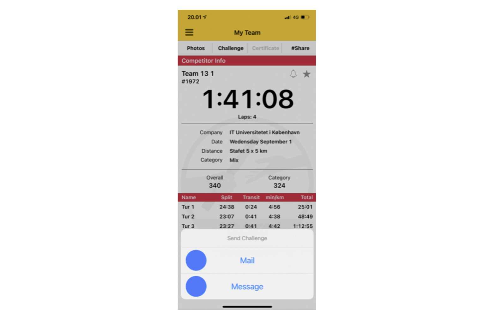

# User control and freedom

Users often choose system functions by mistake and will need a clearly marked “emergency exit” to leave the unwanted state without having to go through an extended dialogue. Support undo and redo.

# Counterexamples

## No Way Back

The DHL app does not allow me to go back after clicking on Send a Challenge by mistake. I have to kill the app and start again ^^!

