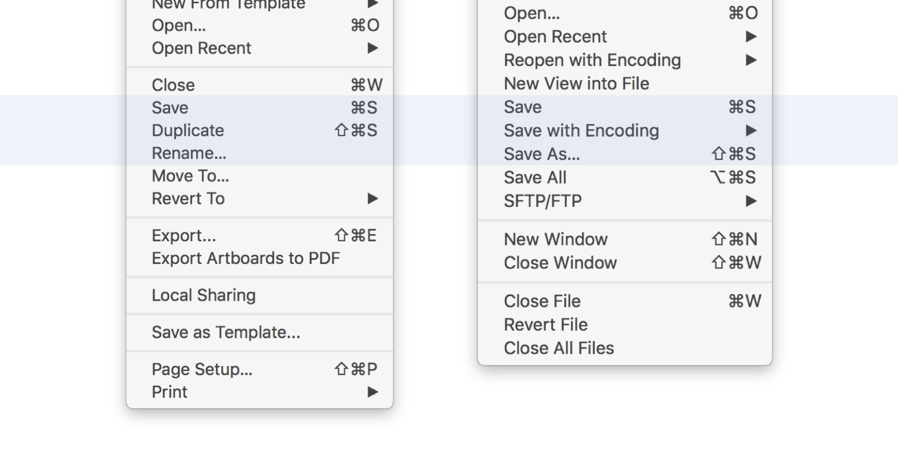
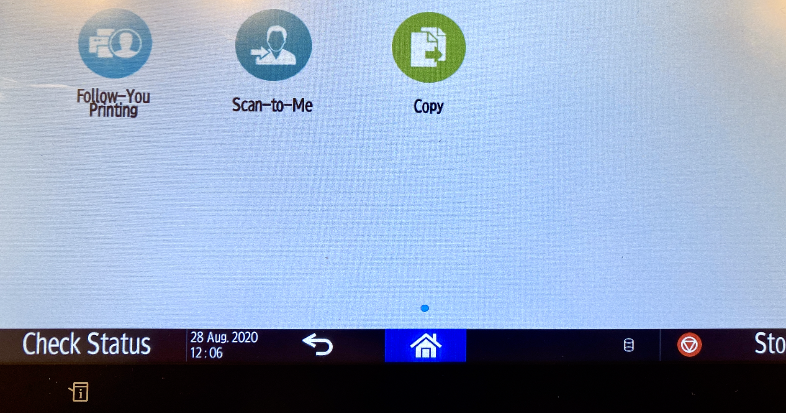
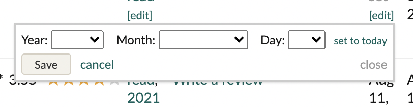

# Consistency and standards

Consistency and standards means that words, situations, actions and affordances should mean the same thing across different elements within your app, and across multiple platforms. 

# Examples

### Apple's Duplicate Menu Option

E.g. All the world used to know what *Save* and *Save As ..* meant. Then Apple introduced the *Duplicate* + *Rename*  idea as a replacement for *Save As...* people hated it. Besides being inconsistent with the rest of the UI world, the pattern also is a failure of another heuristic: [7_flexibility_and_efficiency](7_flexibility_and_efficiency.md). 

### Terminology Consistency (mircea)

Inconsistent printer wording that annoys Mircea *every time he prints*.

### Two Different Buttons -- One Single Action (vibeke)

The add date read pop-up box on the goodreads.com website has two options of stopping the action happening, there is no indication of the difference between close and cancel. This creates a illusion that there is a difference between the two options, when in fact they result in the same action. 
