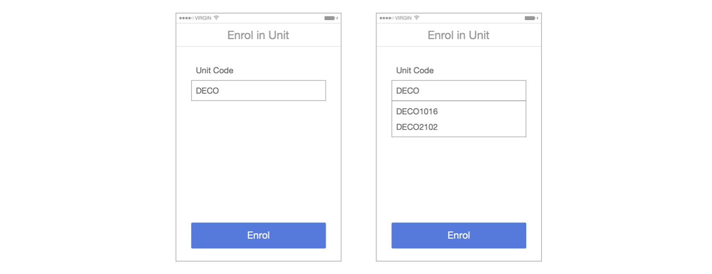

# Error prevention

Even better than good error messages is a careful design that prevents a problem from occurring in the first place. Either eliminate error-prone conditions or check for them and present users with a confirmation option before they commit to the action.

A possible example is preventing the user from typing errors by providing predefined choices that they can select from. 

