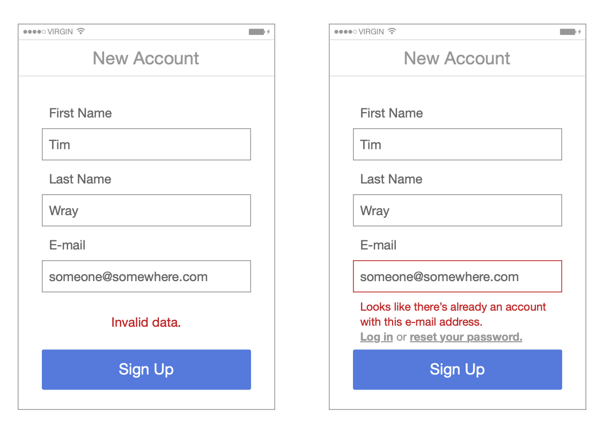
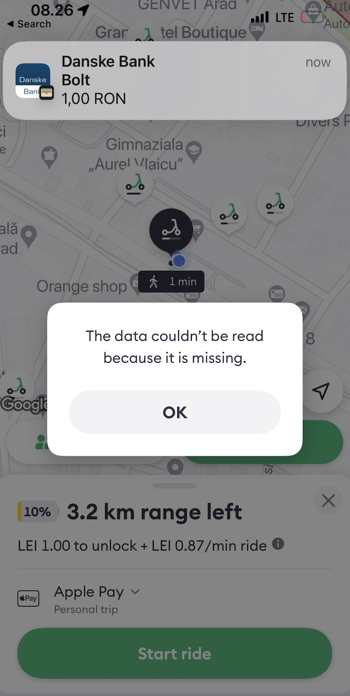

# Help users recognize, diagnose, and recover from errors

Error messages should be expressed in plain language (no codes), precisely indicate the problem, and constructively suggest a solution.

In the example below, Tim Wray shows two possible error messages that could be displayed in a creation dialog for the situation when the user attempts to create an account that already exists.

# Counter-Examples

## Most Uninformative Tautology 

Mircea: In the summer of 2023, I booked a scooter in Arad, my hometown in Romania using the Bolt app. After I agreed to make a payment of 1RON (approx. 0.25EUR) to prove that my card is valid, and after I saw the notification from the bank that the payment was done, the app showed probably the most useless error message in the history of error messages. 

